# RecipePro

RecipePro is a recipe app that allows users to explore a diverse collection of recipes spanning various cuisines, dietary requirements, meal types, and food intolerances. It allows users to explore an extensive library of recipes curated for every taste and occasion and even save them for easy access later. Users can also leave comments on recipes to share their cooking experiences with other users and glean insights from other reviews. Furthermore, users can search for recipes and filter out the results. The app requires an active network connection to function properly and can only run on devices running Android 12 (API 31) and above.

Contact me for the source code.

## Screenshots
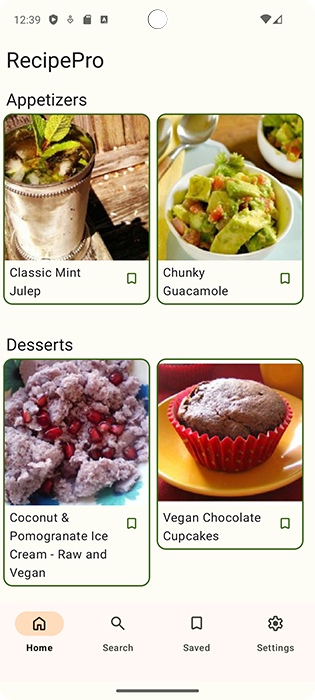  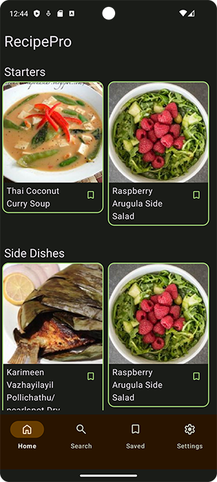
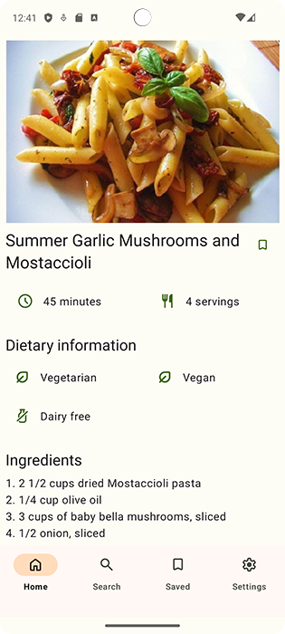  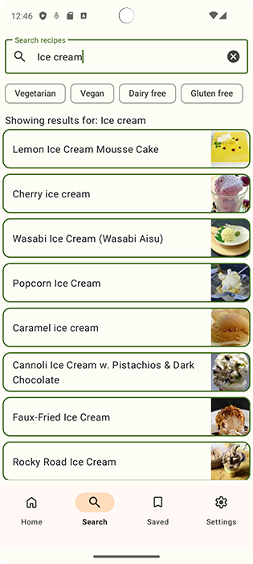
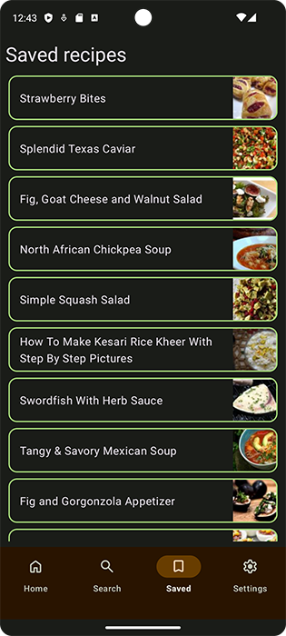  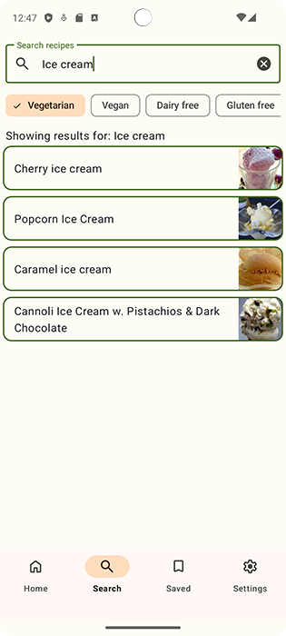
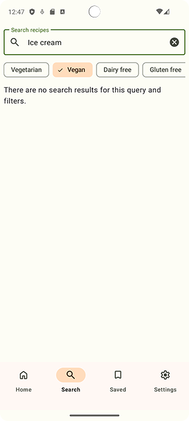  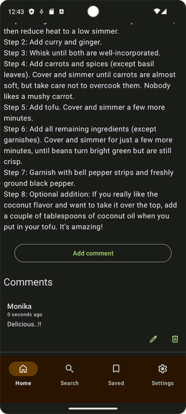
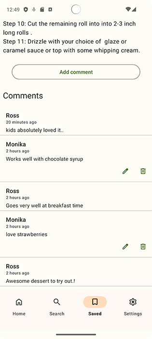  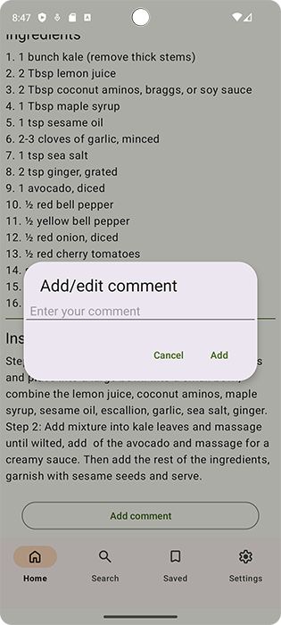
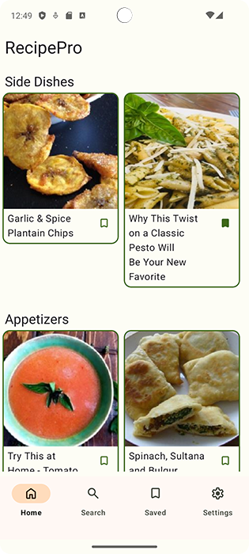  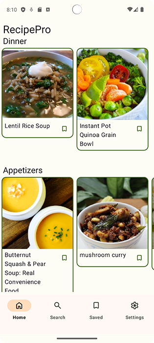
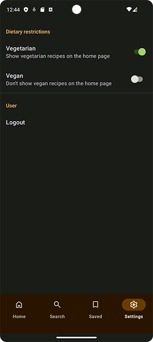
